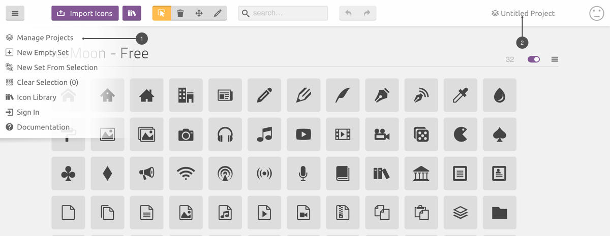
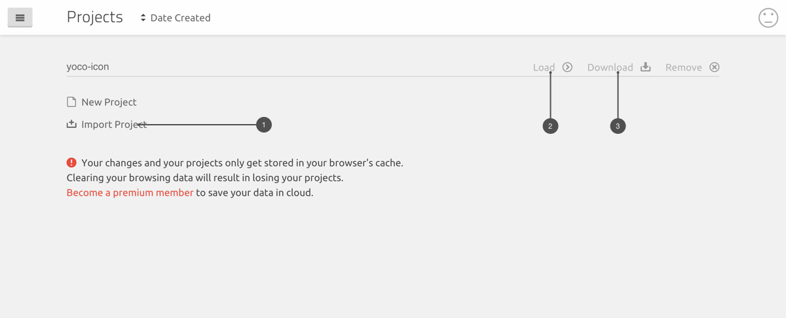
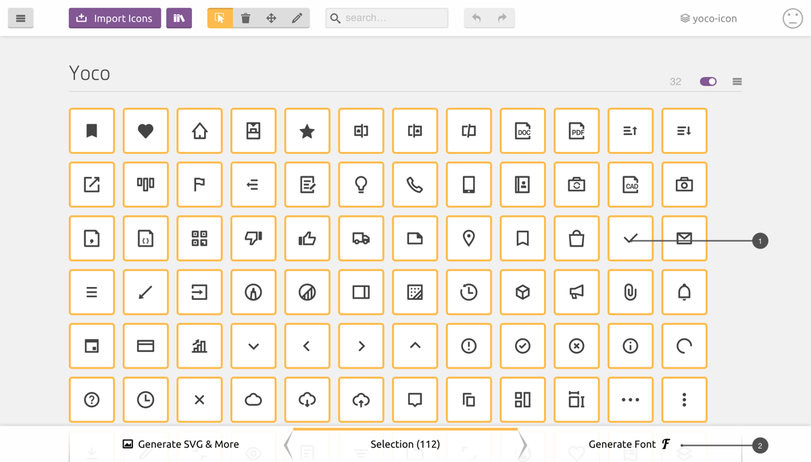
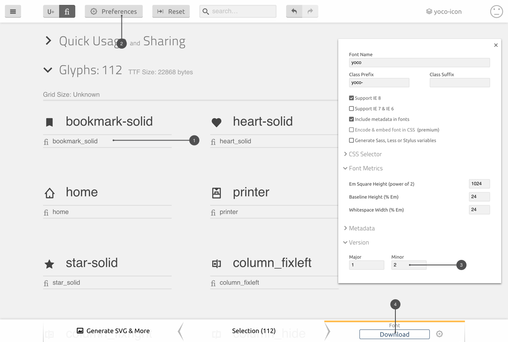

# How to Build and Publish Yoco Icon

The Yoco Icon is using font ligatures which we havn't found a good solution for to generate icon font automatically, instead we using a third party service called [`icomoon`](https://icomoon.io/app) to build the font.

## Generate Icon Font

### Import and Load the yoco icon project



When you open [iconmoon](https://icomoon.io/app) first time, you need import `yoco` project. You can click `Manage Projects¹` or `top right corner²` to accese project page.



In project page, you need `Import Project¹` by uploading the [`yoco-icon.json`](./yoco-icon.json) to icomoon. `Load²` the project and start editing.

> After you add new icons to yoco, remember to `download³` the newest version.

### Edit and Generate Icons



You can drag new icons to `middle area¹`. When you finished uploading the new icons, you can start `Generate Font²`.



For every icon, you need specify a `ligature¹`. You should not using `-` or `empty space` for ligature. If the icon is solid style, you need add suffix `_solid`.

Before you `download⁴` the font files, you need change the `verison number³` by opening the `preferences²`

We apply follwing font metrics.

| Type             | Metrics |
|------------------|---------|
| Square Height    | 1024    |
| Baseline Height  | 24      |
| Whitespace Width | 24      |

## Prepare for Build

1. Replace all the files in `docs/fonts` with new download font files.
2. `Download³` the new `yoco-icon.json` in project manage page and replace the old `docs/yoco-icon.json` file.
3. Move all new svg files to `svg` folder.

You can serve `docs/index.html` with `http-server` and preview your new icons.

## Publish Yoco

In `yoco` folder, run following command:

```
yarn publish
```

It will run a pre-publish command to generate all the files need to be published on `npm`.
